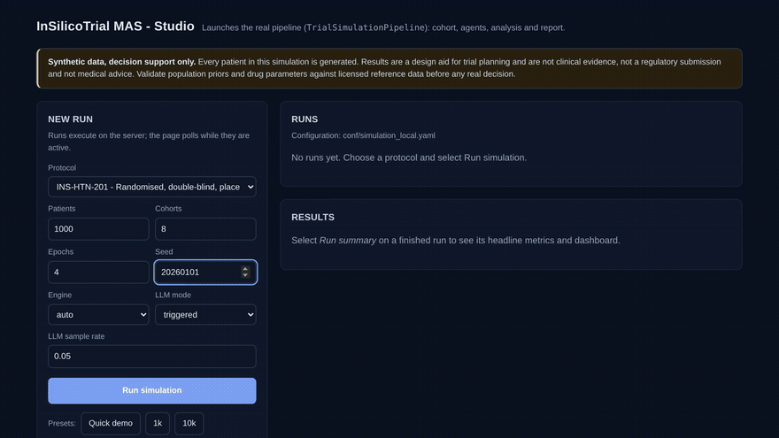
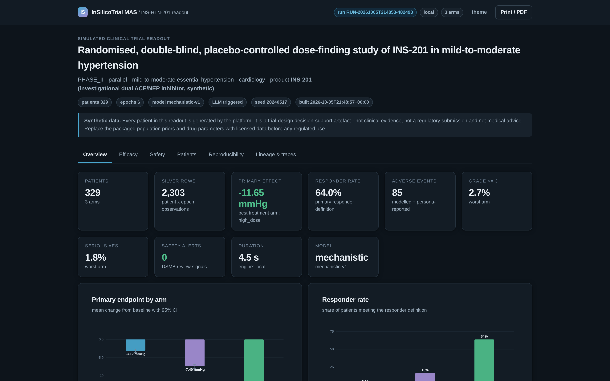
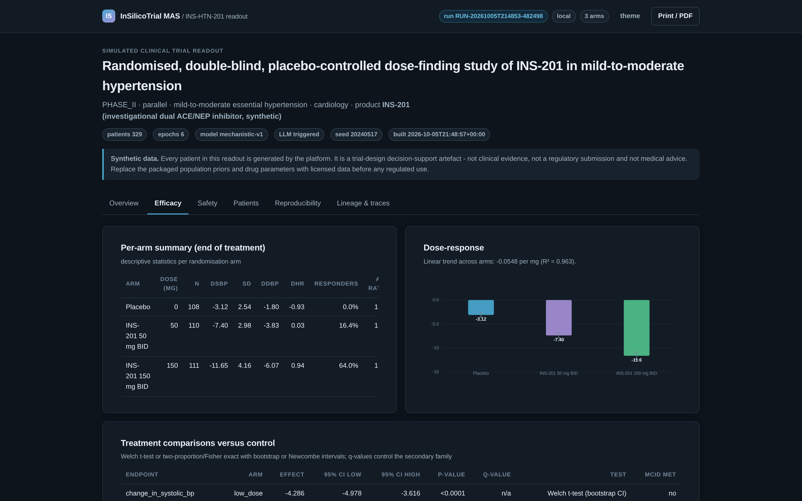
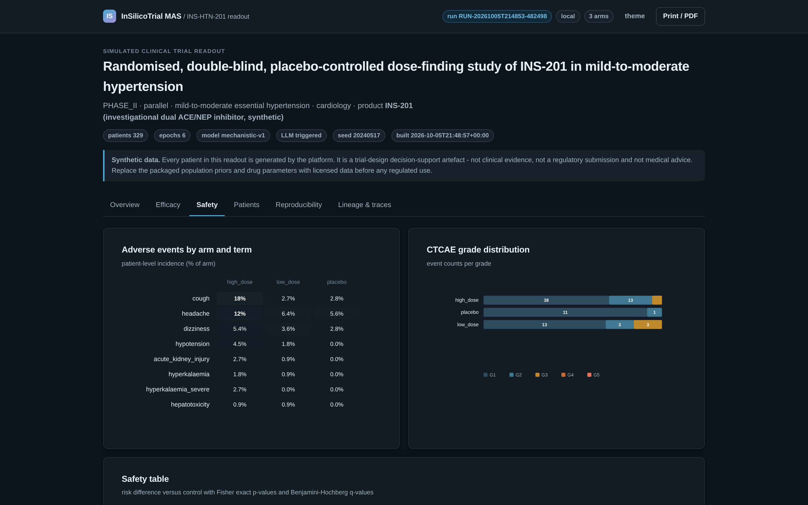
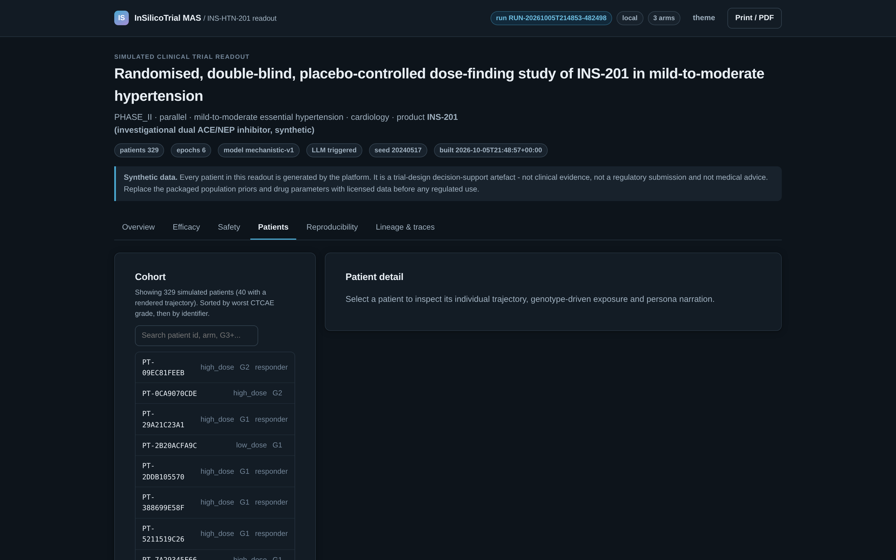

<div align="center">

# InSilicoTrial MAS

**Test a clinical trial on a computer before you test it on people.**

A multi-agent simulation platform that builds a synthetic cohort of digital-twin
patients, runs a trial protocol against all of them, and returns an auditable
go/no-go readout — dose by dose, adverse event by adverse event.

[](https://github.com/SergeyGer/InSilicoTrial_MAS/actions/workflows/ci.yml)
[](https://github.com/SergeyGer/InSilicoTrial_MAS/actions/workflows/codeql.yml)
[](docs/DOCKER.md)
[](LICENSE)
[](https://github.com/SergeyGer/InSilicoTrial_MAS/wiki)



<sub>Recorded from the running application: launch a trial in the Studio, watch the
phases complete, then explore the generated readout. Full quality:
[demo-tour.mp4](docs/media/demo-tour.mp4).</sub>

</div>

---

## The problem this solves

A single Phase II trial costs tens of millions and takes years. The most common
reason a promising drug fails is not a bad molecule — it is a **bad trial design**:
the dose was wrong, the endpoint was measured at the wrong time, the cohort was too
small to see the effect, or a safety signal only became visible after thousands of
patients had been exposed.

Those questions are answerable *before* the first human dose. **InSilicoTrial MAS**
builds a synthetic population, runs the candidate protocol against it, and shows
what would happen: who responds, at which exposure, which adverse events appear, and
whether an independent safety board would have stopped the study.

It is a **decision-support tool for trial design** — the kind of evidence that turns
"we think 40 mg is right" into "40 mg gives a 64 % response rate with 2.7 % grade 3+
toxicity; 20 mg is under-dosed; the stopping rule would not have triggered".

## What it does, in one picture

| Step | What happens | What you get |
| --- | --- | --- |
| **1. Build a population** | Thousands of virtual patients with their own physiology, medical history and pharmacogenomics | A cohort you can screen, exactly like a real one |
| **2. Run the protocol** | Screening, randomisation, dosing, titration, adherence, drop-outs — executed by the platform, not scripted by hand | A trial that behaves like a trial |
| **3. Simulate every patient** | Each virtual patient reacts to the drug: exposure, biomarker response, adverse events, and a narrated account of how they feel | One auditable record per patient per visit |
| **4. Analyse and judge** | An independent statistical agent compares arms, controls for multiplicity, monitors safety and evaluates stopping rules | A readout with confidence intervals, forest plots and DSMB signals |
| **5. Share the evidence** | A self-contained interactive dashboard, a written report and analysis-ready exports | Something a clinical team can actually review |

## See it

| | |
| --- | --- |
|  |  |
| **Overview** — the primary endpoint with its confidence interval, responder rate, safety signals and a CONSORT-style account of who was screened and enrolled | **Efficacy** — per-arm summaries, dose-response, exposure, and a comparison table with effect sizes, intervals, p-values and multiplicity-adjusted q-values |
|  |  |
| **Safety** — adverse events by arm and term, CTCAE grade distribution, risk differences and threshold monitors for every stopping rule | **Patients** — every digital twin is inspectable: dose, exposure, blood pressure, adverse events and the persona's own account of the visit |

The two remaining screens — the reproducibility audit and the agent/table/report
lineage graph — are in the
[UI guide](https://github.com/SergeyGer/InSilicoTrial_MAS/wiki/User-Interface).

## Try it in one command

```bash
git clone https://github.com/SergeyGer/InSilicoTrial_MAS.git && cd InSilicoTrial_MAS
docker compose up -d studio      # open http://localhost:8765
docker compose run --rm demo     # or run a trial straight away
```

No Python, no Java, no credentials and no internet connection are required: the
container ships a deterministic offline persona provider, so a complete trial is
reproducible on any machine. Prefer a plain install, Windows, or WSL? The
[Getting Started](https://github.com/SergeyGer/InSilicoTrial_MAS/wiki/Getting-Started)
page has all three paths, step by step.

## What this project demonstrates

Built end to end — architecture, science, distributed execution, interfaces,
infrastructure, security and documentation — by one engineer.

| Capability | Evidence in this repository |
| --- | --- |
| **Distributed systems engineering** | The same agent code runs on one core, in a process pool, or across a Spark cluster — and produces **bit-identical** results, proven by an automated equivalence test on every commit |
| **Applied machine learning** | A hybrid model: mechanistic pharmacology as the backbone, a trained regression head for the residual, calibrated against clinical expectations rather than hand-tuned |
| **LLM engineering, done soberly** | Language models narrate patient experience only; medical decisions stay mechanistic. Caching, rate limiting, timeouts, offline fallback and prompt hashing keep a 10,000-agent run alive through a provider outage |
| **Statistical rigour** | Confidence intervals, exact tests and multiplicity control implemented in-house so results are reproducible everywhere — no black-box dependency |
| **Cloud and infrastructure as code** | Terraform provisions Unity Catalog, S3, IAM and service principals; a Databricks Asset Bundle deploys the job; containers package the whole platform |
| **Product thinking** | Three audiences, three surfaces: a written report for clinicians, an interactive dashboard for reviewers, a live Studio for analysts who want to explore |
| **Engineering discipline** | 231 automated tests, static analysis and container scanning on every change, automated dependency updates, and a documented decision behind every design trade-off |
| **Communication** | A recruiter-facing README, a technical wiki of twenty pages, generated architecture diagrams, and a product tour regenerated from the running application |

**Technology keywords:** Python · Apache Spark · Delta Lake · MLflow · Unity Catalog ·
Amazon Bedrock · LangChain · Terraform · Docker · GitHub Actions · AWS · Parquet ·
pydantic · pytest.

## Why the design looks the way it does

Three decisions explain most of the repository, and each has a page behind it:

* **The trial is modelled as agents, not as one big equation.**
  A protocol team, thousands of participants and an independent statistician have
  different information and make different decisions. Keeping them separate is what
  enforces blinding, makes interim safety reviews possible, and stops one provider
  outage from destroying a run.
  → [Why agents](https://github.com/SergeyGer/InSilicoTrial_MAS/wiki/Why-Agents)
* **Determinism is a feature, not an accident.**
  Any run can be replayed exactly, years later, and two different execution engines
  are proven to agree. That is what makes the output usable as evidence.
  → [Reproducibility](https://github.com/SergeyGer/InSilicoTrial_MAS/wiki/Reproducibility)
* **The boring path is the default path.**
  Offline personas, no credentials, no network, one command — the sophisticated
  cloud deployment is opt-in, not a prerequisite.
  → [Getting Started](https://github.com/SergeyGer/InSilicoTrial_MAS/wiki/Getting-Started)

## Documentation

This README stays at the level of *what it does and why it matters*. Everything an
engineer, analyst or product manager needs is in the
**[project wiki](https://github.com/SergeyGer/InSilicoTrial_MAS/wiki)**:

| Getting started | The science | The platform |
| --- | --- | --- |
| [Getting Started](https://github.com/SergeyGer/InSilicoTrial_MAS/wiki/Getting-Started) | [Why Agents](https://github.com/SergeyGer/InSilicoTrial_MAS/wiki/Why-Agents) | [Architecture](https://github.com/SergeyGer/InSilicoTrial_MAS/wiki/Architecture) |
| [Docker and Compose](https://github.com/SergeyGer/InSilicoTrial_MAS/wiki/Docker-and-Compose) | [Agents](https://github.com/SergeyGer/InSilicoTrial_MAS/wiki/Agents) | [Engines and Scaling](https://github.com/SergeyGer/InSilicoTrial_MAS/wiki/Engines-and-Scaling) |
| [Configuration and Credentials](https://github.com/SergeyGer/InSilicoTrial_MAS/wiki/Configuration-and-Credentials) | [Pharmacology and Models](https://github.com/SergeyGer/InSilicoTrial_MAS/wiki/Pharmacology-and-Models) | [Reproducibility](https://github.com/SergeyGer/InSilicoTrial_MAS/wiki/Reproducibility) |
| [Deployment on Databricks and AWS](https://github.com/SergeyGer/InSilicoTrial_MAS/wiki/Deployment-Databricks-AWS) | [Statistics and Readouts](https://github.com/SergeyGer/InSilicoTrial_MAS/wiki/Statistics-and-Readouts) | [LLM Integration](https://github.com/SergeyGer/InSilicoTrial_MAS/wiki/LLM-Integration) |
| [Observability and Troubleshooting](https://github.com/SergeyGer/InSilicoTrial_MAS/wiki/Observability-and-Troubleshooting) | [Data Model](https://github.com/SergeyGer/InSilicoTrial_MAS/wiki/Data-Model) | [User Interface](https://github.com/SergeyGer/InSilicoTrial_MAS/wiki/User-Interface) |
| [FAQ](https://github.com/SergeyGer/InSilicoTrial_MAS/wiki/FAQ) · [Glossary](https://github.com/SergeyGer/InSilicoTrial_MAS/wiki/Glossary) | [Ethics and Limitations](https://github.com/SergeyGer/InSilicoTrial_MAS/wiki/Ethics-and-Limitations) | [Security](https://github.com/SergeyGer/InSilicoTrial_MAS/wiki/Security) · [Testing](https://github.com/SergeyGer/InSilicoTrial_MAS/wiki/Testing-and-Verification) |

## Project status

| | |
| --- | --- |
| **Version** | 1.0.0 — every capability described above is implemented, tested and documented |
| **Runs on** | A laptop (no cloud account), Docker, Databricks on AWS |
| **Verification** | 231 automated tests, continuous integration on every change, security scanning, reproducible runs |
| **Next** | See the [roadmap](https://github.com/SergeyGer/InSilicoTrial_MAS/wiki/Roadmap) — adaptive dose-escalation designs, sparse PK sampling, external control arms |

## Responsible use

Every patient in this platform is generated. It is a **trial-design decision-support
tool**: not clinical evidence, not a regulatory submission and not medical advice.
The bundled population priors and drug parameters are illustrative and must be
replaced with licensed reference data and validated estimates before any regulated
use. The full statement — including what the model deliberately does not capture —
is in
[Ethics and Limitations](https://github.com/SergeyGer/InSilicoTrial_MAS/wiki/Ethics-and-Limitations).

## Contributing, security, licence

Contributions are welcome: start with
[Contributing and Development](https://github.com/SergeyGer/InSilicoTrial_MAS/wiki/Contributing-and-Development)
or the [good first issues](https://github.com/SergeyGer/InSilicoTrial_MAS/issues).
Scientific changes must come with calibration evidence and must not reduce
reproducibility. Please report vulnerabilities privately, as described in
[SECURITY.md](SECURITY.md).

MIT licensed — see [LICENSE](LICENSE).

<div align="center">
<sub>
<strong>In silico</strong> (Latin, "in silicon") — an experiment run on a computer rather than
in a living organism (<em>in vivo</em>) or a test tube (<em>in vitro</em>) ·
<strong>Trial</strong> — a clinical study of a drug or treatment ·
<strong>MAS</strong> — Multi-Agent System: work done by a network of autonomous agents rather than one program.
<br>
Read together: <em>a multi-agent system for computer-simulated clinical trials.</em>
</sub>
</div>
