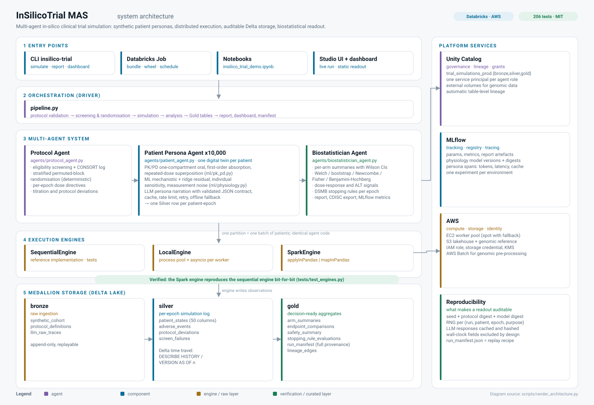

<div align="center">

# InSilicoTrial MAS

**Multi-agent in-silico clinical trial simulation on Databricks & AWS**

Simulate a synthetic cohort of digital-twin patients against a trial protocol —
exposure, efficacy, adverse events and a go/no-go readout — before the first
human dose.

[](https://github.com/SergeyGer/InSilicoTrial_MAS/actions/workflows/ci.yml)
[](https://github.com/SergeyGer/InSilicoTrial_MAS/actions/workflows/codeql.yml)
[](LICENSE)
[](pyproject.toml)
[](pyproject.toml)
[](pyproject.toml)
[](tests)
[](databricks.yml)
[](terraform)

[Quickstart](#quickstart) · [Architecture](#architecture) · [Technology stack](#technology-stack) ·
[User interface](#user-interface) · [Documentation](#documentation) · [Contributing](CONTRIBUTING.md)

</div>

---

## What it is

A clinical trial costs millions before the first patient is enrolled, and most
dose-finding failures are only obvious in hindsight. **InSilicoTrial MAS** builds a
synthetic cohort of digital-twin patients, runs a protocol against all of them in
parallel, and returns an auditable readout: which dose works, at what exposure,
with which adverse events, and whether a Data Safety Monitoring Board rule would
have stopped the study.

Each patient is an independent agent with its own phenotype, medical history and
pharmacogenomic markers. A **Protocol Agent** organises the trial, thousands of
**Patient Persona Agents** respond to it (mechanistic PK/PD + a trained ML model +
an LLM persona), and a **Biostatistician Agent** turns the logs into statistics,
safety monitoring and a compliance-style report.

Built for **Databricks on AWS**: Spark distributes the cohort, Delta Lake makes
every step auditable and rewindable, MLflow tracks the models, Unity Catalog
governs the data. The same code still runs end-to-end on a laptop with no cloud
account, no API keys and no internet.

> **Synthetic data only.** This is a trial-design decision-support tool: not
> clinical evidence, not a regulatory submission, not medical advice. See
> [Ethics & limitations](docs/ETHICS_AND_LIMITATIONS.md).

---

## Technology stack

| Layer | Technologies | Role in this project |
| --- | --- | --- |
| **Language & runtime** | Python 3.10 – 3.12, Java 17 (Spark runtime) | Whole platform; the engine layer degrades gracefully when no JVM is present |
| **Distributed compute** | **PySpark 3.5** (`applyInPandas`, `mapInPandas`, Arrow), local `multiprocessing` + `asyncio` | Three interchangeable engines; cohorts up to millions of agent-epochs |
| **Storage & table format** | **Delta Lake 3.2**, Parquet + Arrow, local versioned store | Medallion architecture, `DESCRIBE HISTORY`, `VERSION AS OF` time travel |
| **Governance** | **Unity Catalog** (catalogs, schemas, volumes, grants), service principals | Three-tier namespace, per-agent identities, application-level lineage |
| **ML lifecycle** | **MLflow** (tracking, model registry, tracing) | Run parameters/metrics/artefacts, model versions and digests, LLM spans |
| **Modelling** | NumPy ridge regression (default head), optional scikit-learn / XGBoost, custom PK/PD | Biomarker prediction: mechanistic backbone + learned residual |
| **LLM orchestration** | **LangChain** (`langchain-core`, `langchain-aws`), **Amazon Bedrock** (Claude), deterministic offline provider | Persona narration with a validated JSON contract, caching and rate limiting |
| **Statistics** | Implemented in-house (Wilson, Newcombe, Welch, Fisher exact, Mann-Whitney, Benjamini-Hochberg, bootstrap) | No SciPy dependency, so readouts stay bit-reproducible everywhere |
| **Configuration & validation** | pydantic v2, PyYAML, Jinja2, `dataclasses` | Protocol schema, trial config, YAML/env overrides, report templates |
| **Infrastructure as code** | **Terraform** (Databricks + AWS providers), **Databricks Asset Bundles**, AWS S3 / IAM / EC2 spot / Batch | Reproducible cloud environments and a deployable simulation job |
| **User interface** | Server-rendered **SVG** + vanilla JS, Python `http.server` | Self-contained dashboard and a live Studio — zero UI dependencies, no CDN |
| **Quality gates** | pytest (+ pytest-cov, pytest-asyncio), Ruff, mypy, GitHub Actions, CodeQL, Dependabot | 206 tests, lint/type-clean, security scanning, dependency hygiene |

---

## Architecture



<sub>Rendered from <a href="scripts/render_architecture.py">scripts/render_architecture.py</a> — the diagram is generated, so it stays in sync with the code. A <a href="docs/dashboard-wireframe.svg">dashboard wireframe</a> shows the readout layout.</sub>

**How a run flows**

1. **Entry point** — CLI, Databricks job, notebook or the live Studio UI.
2. **Protocol Agent** validates the protocol, screens the synthetic population
   against the eligibility criteria (with a CONSORT-style failure log) and
   randomises it with deterministic stratified permuted blocks.
3. **Patient Persona Agents** run one per patient. For every epoch an agent
   computes individual PK, predicts biomarkers with the hybrid physiology model,
   samples adverse events from the drug's logistic models and — when triggered —
   narrates symptoms through an LLM persona with a validated JSON contract.
4. **Engine layer** executes those agents: sequentially, in a process pool, or as
   Spark `applyInPandas` / `mapInPandas` jobs. The agent code is identical, and the
   engines are verified to produce **bit-identical** results.
5. **Storage** lands one Silver row per patient-epoch (Bronze for inputs, Gold for
   aggregates), versioned so any earlier readout can be replayed or restored.
6. **Biostatistician Agent** aggregates, tests against control with confidence
   intervals, monitors safety against the protocol's stopping rules and emits the
   report, the interactive dashboard, CDISC-inspired exports and the run manifest.

**The three agents**

| Agent | Module | Responsibility |
| --- | --- | --- |
| Protocol Agent | [`agents/protocol_agent.py`](src/insilico_trial_mas/agents/protocol_agent.py) | Validation, eligibility screening, stratified block randomisation, per-epoch dose directives, titration, protocol deviations |
| Patient Persona Agent | [`agents/patient_agent.py`](src/insilico_trial_mas/agents/patient_agent.py) | Individual PK/PD, hybrid ML prediction, adverse-event sampling, LLM narration, adherence and discontinuation |
| Biostatistician Agent | [`agents/biostatistician_agent.py`](src/insilico_trial_mas/agents/biostatistician_agent.py) | Arm summaries, treatment comparisons, multiplicity control, safety analytics, DSMB stopping rules, report payload |

---

## What is actually verified

| Claim | Evidence |
| --- | --- |
| Sequential, multiprocessing and Spark engines produce **bit-identical** trials | [`tests/test_engines.py`](tests/test_engines.py) — `applyInPandas` and `mapInPandas` compared against the reference engine |
| Re-running with the same seed reproduces the trial exactly | [`scripts/verify_reproducibility.py`](scripts/verify_reproducibility.py), [`tests/test_pipeline.py`](tests/test_pipeline.py) |
| Simulated trials are **clinically plausible** (exposure, effect size, AE rates, no fatal headaches) | [`tests/test_calibration.py`](tests/test_calibration.py), [`scripts/calibrate_protocol.py`](scripts/calibrate_protocol.py) |
| Adverse-event parameters are fitted to target incidence, not hand-tuned | [`scripts/fit_ae_parameters.py`](scripts/fit_ae_parameters.py) |
| Statistics match reference values (Wilson, Fisher exact, Welch, Benjamini-Hochberg) | [`tests/test_stats.py`](tests/test_stats.py) |
| An LLM outage cannot destroy a run | cache → rate limit → timeout → retry → offline fallback, [`tests/test_llm.py`](tests/test_llm.py) |
| The readout dashboard is self-contained and complete | [`tests/test_ui_dashboard.py`](tests/test_ui_dashboard.py) |
| The Studio drives the real pipeline over HTTP | [`tests/test_ui_studio.py`](tests/test_ui_studio.py) |
| Every notebook cell of the specification executes | [`scripts/run_notebook.py`](scripts/run_notebook.py), run in CI |
| Infrastructure is valid | `terraform validate` and the Databricks bundle schema check in CI |

---

## Quickstart

### 1. Laptop — no credentials, no cloud

```bash
git clone https://github.com/SergeyGer/InSilicoTrial_MAS.git
cd InSilicoTrial_MAS
bash scripts/bootstrap.sh          # venv + package + environment checklist

source .venv/bin/activate
insilico-trial demo --patients 400 --epochs 6
```

The demo writes `artifacts/demo/<RUN-ID>/` with the run manifest, the
Markdown/HTML/JSON report, the interactive dashboard, CDISC-inspired exports and
the Silver observations.

### 2. Spark on the driver (Databricks Community Edition pattern)

```bash
bash scripts/bootstrap.sh --spark   # installs PySpark and a portable JRE in .toolchain/
make simulate-spark PATIENTS=2000
make test-spark                     # proves Spark == sequential
```

### 3. Databricks on AWS

```bash
cd terraform && cp terraform.tfvars.example terraform.tfvars && terraform apply
cd .. && bash scripts/databricks_deploy.sh --target prod --run
```

Sizing, cost control and the failure playbook live in the
[runbook](docs/RUNBOOK_DATABRICKS_AWS.md).

---

## User interface

Two dependency-free surfaces, both generated from the same run artefacts.

### Readout dashboard — `report/dashboard.html`

Written automatically after every run: a single self-contained HTML file with
inline SVG charts, openable from a file path, a Unity Catalog volume, an e-mail
attachment, `displayHTML` in a Databricks notebook, or printable to PDF.

```bash
insilico-trial dashboard --run artifacts/ --open     # newest run in a directory
```

| Screen | What a reviewer gets |
| --- | --- |
| **Overview** | KPI strip, primary endpoint with 95% CI, responder rate, forest plot of every endpoint, CONSORT disposition, DSMB signals |
| **Efficacy** | Per-arm summary, dose-response with trend, comparison table (effect, CI, p, q, test, MCID), mean trajectories with confidence bands, exposure |
| **Safety** | Adverse-event heatmap (arm × term), CTCAE grade distribution, risk differences with q-values, stopping-rule threshold monitors |
| **Patients** | Searchable digital twins: individual dose/exposure/BP/AE trajectory and the persona's verbatim narration |
| **Reproducibility** | Protocol and model digests, seed, environment, data-quality audit, exact replay command |
| **Lineage & traces** | Agent → table → report graph, token and latency distributions, Mermaid source |

### Live Studio — `insilico-trial studio`

```bash
insilico-trial studio --config conf/simulation_local.yaml    # http://127.0.0.1:8765
```

Pick a protocol, cohort size, engine and LLM policy, press run, and watch the
pipeline phases progress; the finished dashboard appears in place. The Studio runs
the real pipeline on a daemon thread over a standard-library HTTP server.

Static previews are checked in and regenerated by
[`scripts/render_ui_previews.py`](scripts/render_ui_previews.py):

* [**dashboard preview**](docs/dashboard-preview.html) — a real readout from a
  90-patient run (download and open it in a browser; CI also uploads the dashboard
  of every demo run as a build artefact);
* [**Studio shell**](docs/studio-preview.html) — the launcher page;
* [**dashboard anatomy**](docs/dashboard-wireframe.svg) — a labelled wireframe.

Design record and screen-by-screen rationale: [docs/UI.md](docs/UI.md).

---

## How it works

**Pharmacokinetics.** One-compartment oral model with first-order absorption and a
closed-form repeated-dose superposition; individual clearance from body weight,
age, eGFR and CYP2D6 phenotype.

```
C(t) = F·D·ka / (V·(ka − ke)) · (e^(−ke·t) − e^(−ka·t)),   ke = ln2 / t½
```

**Pharmacodynamics.** Sigmoid Emax on the average steady-state concentration
(peak concentration for QTc and hepatotoxicity), plus placebo effect, disease
progression, comorbidity burden, per-patient sensitivity and measurement noise.

**Learned component.** A ridge-regression residual head trained on synthetic
historical cohorts, stored as a versioned, digest-hashed artefact and optionally
registered in the MLflow Model Registry.

**Determinism.** Every stochastic draw comes from
`sha256(seed, run, patient, epoch, purpose)`, so partition layout cannot change a
single number. Wall-clock fields (`observation_ts`, `llm_latency_ms`) are excluded
from equivalence checks by design.

**Adverse events.** Logistic models per MedDRA-style term with CTCAE grade
distributions, fitted so cumulative incidence matches clinical expectations at each
dose level.

---

## Command line

| Command | Purpose |
| --- | --- |
| `insilico-trial env-check` | Runtime checklist and engine recommendation |
| `insilico-trial validate-protocol` | Validate a protocol, print review warnings |
| `insilico-trial generate-cohort` | Write the screening population (Parquet/CSV) |
| `insilico-trial simulate` | Full pipeline: cohort → agents → Silver → Gold → report |
| `insilico-trial report --run <dir>` | Rebuild a report from a finished run |
| `insilico-trial dashboard --run <dir> --open` | Build the interactive readout |
| `insilico-trial studio` | Serve the live Studio UI |
| `insilico-trial time-travel --table silver/patient_states --version 1 --where "sbp > 140"` | Point-in-time read (`VERSION AS OF`) |
| `insilico-trial lineage --run <dir> --format mermaid` | Data lineage of a run |
| `insilico-trial traces --tree first` | LLM tokens, latency and span hierarchy |
| `insilico-trial train-physiology --register` | Train and register the physiology model |
| `insilico-trial demo` | Small offline end-to-end run |

Every command supports `--json`.

---

## Configuration

Profiles in [`conf/`](conf):

| File | Use case |
| --- | --- |
| `simulation_local.yaml` | Laptop/CI: local Parquet lake, offline LLM, `auto` engine |
| `simulation_cluster.yaml` | AWS Databricks: Spark engine, Delta + Unity Catalog, Bedrock personas, MLflow |
| `simulation_community_edition.yaml` | Databricks CE: driver multiprocessing, Hive metastore |
| `trial_protocol_demo.yaml` | Phase II dose-finding protocol: 3 arms, titration, endpoints, DSMB rules, drug PK/AE models |

Any field can be overridden from the environment:
`INSILICO_ENGINE__BACKEND=spark INSILICO_N_PATIENTS=50000 insilico-trial simulate …`

---

## Project layout

```
src/insilico_trial_mas/
  agents/           protocol · patient (persona) · biostatistician
  ml/               pk_pd · physiology (mechanistic + ridge) · training · registry
  llm/              prompts · parsing · cache · rate_limit · resilient · offline · langchain
  engine/           sequential · local (multiprocessing) · spark · checklist · runtime
  storage/          local versioned Parquet · Delta Lake · memory
  governance/       Unity Catalog namespace · lineage
  mlflow_tracking/  tracker · tracing (spans)
  reporting/        report builder · CDISC-inspired exports · Jinja templates
  stats/            SciPy-free estimators
  cohort/           population priors · generator · serialisation
  ui/               charts (SVG) · data · dashboard · studio · theme
  pipeline.py       the single definition of "a simulation run"
  cli.py            command line interface
conf/  notebooks/  terraform/  resources/  scripts/  tests/  docs/  .github/  .vscode/
```

---

## Data model

Medallion architecture, identical on Delta Lake and on the local store:

| Layer | Tables |
| --- | --- |
| **bronze** | `synthetic_cohort`, `protocol_definitions`, `llm_raw_traces` |
| **silver** | `patient_states` (50-column per-epoch contract), `adverse_events`, `protocol_deviations`, `screen_failures` |
| **gold** | `arm_summaries`, `endpoint_comparisons`, `safety_summary`, `stopping_rule_evaluations`, `run_manifest`, `lineage_edges` |

Full column contracts, JSON payload shapes and the CDISC-inspired exports are in
[docs/DATA_MODEL.md](docs/DATA_MODEL.md).

---

## Quality gates

```bash
make check          # ruff + mypy + tests (fast, no JVM needed)
make test-spark     # Spark engine must reproduce the sequential engine
make verify-repro   # two runs, same seed, identical rows
make calibrate      # clinical plausibility bands
make verify-ui      # dashboard and Studio tests
make notebook       # every notebook cell executes
make iac-validate   # terraform fmt + validate
```

CI runs all of the above on every push and pull request across Python 3.10–3.12,
plus CodeQL analysis and Dependabot updates.

---

## Documentation

| Document | Contents |
| --- | --- |
| [docs/ARCHITECTURE.md](docs/ARCHITECTURE.md) | Layered design, engine abstraction, determinism, LLM resilience, diagrams |
| [docs/DATA_MODEL.md](docs/DATA_MODEL.md) | Every table, column, JSON payload and export format |
| [docs/UI.md](docs/UI.md) | UI design record, screens, design system, extension points |
| [docs/RUNBOOK_DATABRICKS_AWS.md](docs/RUNBOOK_DATABRICKS_AWS.md) | Sizing, cost control, monitoring queries, failure playbook |
| [docs/SPEC_COMPLIANCE.md](docs/SPEC_COMPLIANCE.md) | Requirement → implementation → test mapping, and every defect fixed |
| [docs/ETHICS_AND_LIMITATIONS.md](docs/ETHICS_AND_LIMITATIONS.md) | Responsible use, bias, what the model does not capture |
| [docs/REPOSITORY_SETTINGS.md](docs/REPOSITORY_SETTINGS.md) | Recommended GitHub configuration (About, topics, protection rules) |
| [CONTRIBUTING.md](CONTRIBUTING.md) · [SECURITY.md](SECURITY.md) · [CHANGELOG.md](CHANGELOG.md) | How to contribute, how to report a vulnerability, release history |

---

## Limitations and responsible use

Synthetic cohorts cannot reproduce unmeasured confounding or unmodelled biology.
Population priors and drug parameters shipped here are **illustrative** and must be
replaced with licensed reference data and validated PK/PD estimates before any
regulated use. LLM narration is qualitative: responses are cached and prompt hashes
recorded, but a model update changes the narrative. This platform is a trial-design
decision-support tool — not clinical evidence and not medical advice. Read
[docs/ETHICS_AND_LIMITATIONS.md](docs/ETHICS_AND_LIMITATIONS.md) before using it for
a real decision.

## Contributing

Contributions are welcome — see [CONTRIBUTING.md](CONTRIBUTING.md) and the
[Code of Conduct](CODE_OF_CONDUCT.md). Scientific changes (PK/PD, physiology model,
adverse-event parameters) must come with calibration evidence and must not reduce
reproducibility. Security issues: please follow [SECURITY.md](SECURITY.md) instead
of opening a public issue.

## License

MIT — see [LICENSE](LICENSE). Bundled population priors and drug parameters are
illustrative and carry no clinical warranty.

## Citation

```bibtex
@software{insilicotrial_mas,
  title   = {InSilicoTrial MAS: multi-agent in-silico clinical trial simulation},
  author  = {Gerasimov, Sergey},
  year    = {2026},
  version = {1.0.0},
  license = {MIT},
  url     = {https://github.com/SergeyGer/InSilicoTrial_MAS}
}
```

See also [CITATION.cff](CITATION.cff).
