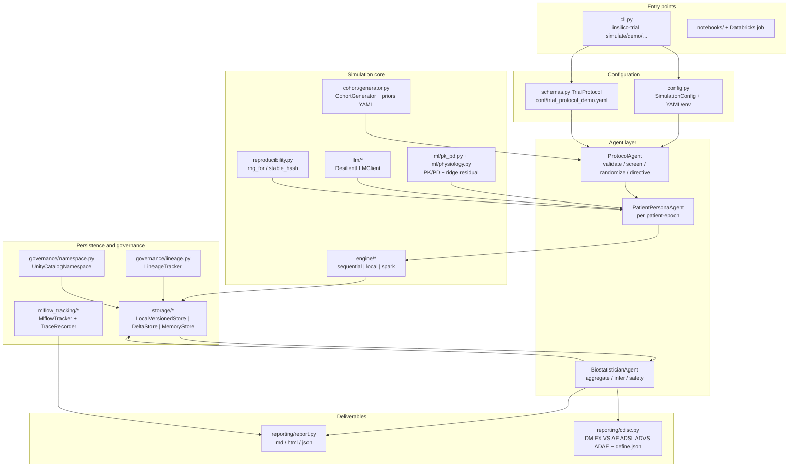
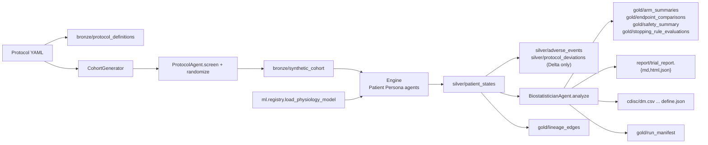
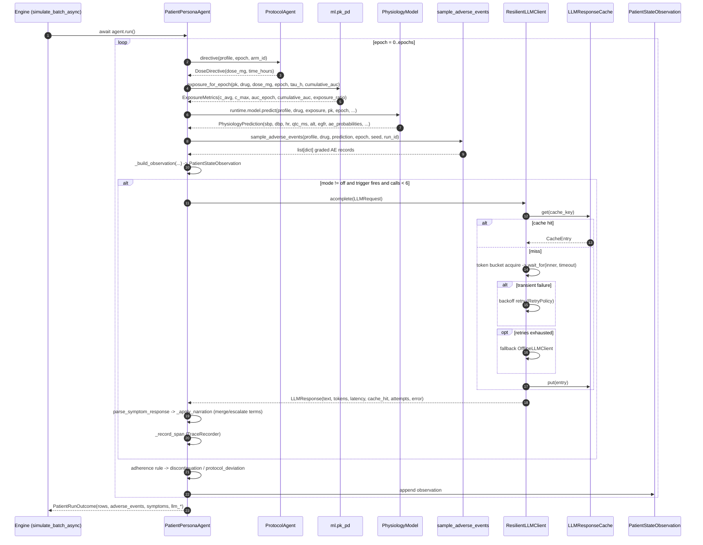

# InSilicoTrial MAS — System Architecture

Scope: this document describes the code that actually exists under `src/insilico_trial_mas/` at
package version `1.0.0` (`version.py`). Every class, function, flag and constant named below was read
from source; the final section indexes the tests that prove each claim.

The platform simulates a randomised clinical trial with synthetic patients. It is a design-optimisation
and decision-support tool, not a source of clinical evidence — see `docs/ETHICS_AND_LIMITATIONS.md`.

## 1. System at a glance

Component and data flow. Layers are shown in dependency order; the engine boundary is the only place
where execution strategy changes.



Medallion flow produced by `pipeline.TrialSimulationPipeline.run()`:



## 2. The three agent types

All agents derive from `BaseAgent` (`agents/base.py`) and share one immutable `AgentContext`
(`run_id`, `protocol`, `config`, `arm_by_patient`, `seed`, `model_*`, `total_epochs`, `created_at`,
`extra`). `AgentContext.arm_of()` falls back to the first arm when a patient has no allocation.

| Agent | Module / class | Role string | Responsibilities (methods) |
| --- | --- | --- | --- |
| Protocol Agent | `agents/protocol_agent.py` → `ProtocolAgent` | `protocol` | `validate()` returns warnings and raises `ProtocolValidationError` on hard errors (non-positive treatment dose, titration max below start dose). `screen()` applies `EligibilityCriteria` and records every screen failure with a reason token (`age_out_of_range`, `renal_impairment`, `hepatic_impairment`, `comorbidity_burden`, `excluded_condition`, `required_condition_absent`, `excluded_genotype_<marker>`). `randomize()` performs deterministic stratified permuted-block allocation and emits an auditable `allocation_table`. `directive()` issues one `DoseDirective` per patient-epoch (titration-aware, `time_hours = epoch * epoch_duration_hours`). `protocol_deviation()` records dose holds/discontinuations. `plan()` = validate + screen + randomize. |
| Synthetic Patient Persona Agent | `agents/patient_agent.py` → `PatientPersonaAgent` | `patient` | One digital patient, epoch by epoch: calls the Protocol Agent for the directive, computes exposure (`exposure_for_epoch`), predicts physiology (`runtime.model.predict`), samples structured AEs (`sample_adverse_events`), optionally narrates with the LLM, applies adherence/discontinuation logic, and emits one `PatientStateObservation` per epoch. `run()` returns a `PatientRunOutcome` with observations, adverse events, symptoms, LLM counters and discontinuation state. |
| Biostatistician Agent | `agents/biostatistician_agent.py` → `BiostatisticianAgent` | `biostatistician` | `analyze()` builds the analysis frames (`extract_adverse_events`, `end_of_treatment_frame`) and returns an `AnalysisResult`: per-arm summaries, treatment-vs-control comparisons, CTCAE safety tabulation, DSMB stopping-rule evaluations, safety alerts, demographics, dose-response, CONSORT-style cohort flow, and a data-quality/reproducibility audit. Statistical primitives live in `stats/estimators.py` (no SciPy dependency). |

Supporting entry points: `simulate_patient(profile, context, runtime)` in `agents/patient_agent.py` is a
one-shot convenience coroutine.

## 3. Layered design

Dependencies point downward; no lower layer imports an upper one (the only deliberate exception is
`engine/runtime.py`, which builds the protocol agent and LLM client for a worker).

| # | Layer | Modules | Responsibility |
| --- | --- | --- | --- |
| 1 | Schemas | `schemas.py`, `version.py`, `errors.py` | Pydantic boundary models (protocol, drug, personas, AE records), `slots` dataclasses on the hot path (`PatientStateObservation`, `SimulationProvenance`, `ArmSummary`, `ComparisonResult`, `StoppingRuleEvaluation`), and the `SILVER_COLUMNS` contract. |
| 2 | ML | `ml/pk_pd.py`, `ml/physiology.py`, `ml/training.py`, `ml/registry.py` | One-compartment PK with first-order absorption and superposition, Emax PD, logistic AE models, ridge residual head, model resolution (artifact → MLflow registry → mechanistic fallback → train-on-demand). |
| 3 | LLM | `llm/base.py`, `prompts.py`, `offline.py`, `langchain_provider.py`, `cache.py`, `rate_limit.py`, `resilient.py`, `factory.py` | Provider abstraction, persona prompt + JSON parsing, offline deterministic provider, resilience stack. |
| 4 | Agents | `agents/base.py`, `protocol_agent.py`, `patient_agent.py`, `biostatistician_agent.py` | The three roles above plus `AgentContext`. |
| 5 | Engine | `engine/base.py`, `partition.py`, `sequential_runner.py`, `local_runner.py`, `spark_runner.py`, `factory.py`, `context.py`, `runtime.py`, `checklist.py` | Backend selection, batch/partition entry points, worker runtime caching. |
| 6 | Storage | `storage/base.py`, `local_store.py`, `delta_store.py`, `factory.py` | `BaseStore` interface, versioned Parquet, Delta Lake, in-memory store. |
| 7 | Governance / tracking | `governance/namespace.py`, `governance/lineage.py`, `mlflow_tracking/tracker.py`, `mlflow_tracking/tracing.py`, `mlflow_tracking/tracer_helpers.py` | Unity Catalog naming and grants, agent-level lineage graph, MLflow tracking + model registry, span-level LLM tracing. |
| 8 | Reporting | `reporting/report.py`, `reporting/cdisc.py`, `templates/report.md.j2`, `templates/report.html.j2` | Jinja2 Markdown/HTML/JSON report with a `DISCLAIMER`, CDISC-inspired SDTM/ADaM subset export. |
| 9 | Pipeline | `pipeline.py` | The single definition of "one simulation run": protocol → cohort → bronze → simulate → silver → analyse → report → gold → CDISC → MLflow → manifest. |
| 10 | CLI | `cli.py` | Twelve subcommands driving the same code path as notebooks and Databricks jobs. |

Also in the tree but outside that stack: `cohort/` (generation + serialisation contract),
`async_utils.py` (`run_sync`, `gather_bounded`), `logging_utils.py`, `config.py`.

### CLI surface (`cli.py`, entry point `insilico-trial = insilico_trial_mas.cli:main`)

| Command | Key flags |
| --- | --- |
| `env-check` | `--config`, `--json` |
| `validate-protocol` | `--protocol`, `--config`, `--json` |
| `generate-cohort` | `--config`, `--protocol`, `--patients`, `--cohorts`, `--seed`, `--out`, `--json` |
| `simulate` | `--config`, `--protocol`, `--patients`, `--cohorts`, `--epochs`, `--seed`, `--engine {auto,sequential,local,spark}`, `--llm-mode {off,sample,triggered,all}`, `--llm-provider {offline,mock,bedrock,openai,langchain}`, `--llm-sample-rate`, `--storage {local,delta,memory}`, `--output-dir`, `--run-id`, `--offline`, `--json` |
| `report` | `--run`, `--config`, `--format {markdown,html,json}` (repeatable), `--json` |
| `time-travel` | `--config`, `--table` (default `silver/patient_states`), `--version`, `--run-id`, `--where`, `--columns`, `--limit`, `--history`, `--json` |
| `lineage` | `--run`, `--format {summary,mermaid,json,edges}`, `--upstream`, `--json` |
| `traces` | `--path`, `--run-id`, `--tree`, `--json` |
| `train-physiology` | `--config`, `--protocol`, `--rows`, `--output`, `--register`, `--json` |
| `demo` | `--patients`, `--epochs`, `--output-dir`, `--engine`, `--json` |

## 4. Execution-engine abstraction

`BaseEngine` (`engine/base.py`) is the interface: `run(cohort_frame, *, run_id=None) -> EngineResult`,
`close()`, `describe()`. `EngineResult` carries `backend`, `n_patients`, `n_rows`, either `rows`
(materialised list of Silver row dicts) or `dataframe` (a lazily evaluated Spark DataFrame), plus
`stats`, `runtime_info` and `duration_seconds`; `is_materialised()` reports which representation is set.

| Backend | Class | Module | Strategy |
| --- | --- | --- | --- |
| sequential | `SequentialEngine` (`backend = "sequential"`) | `engine/sequential_runner.py` | Single process, single thread, batches sized by `engine.batch_size`, `simulate_batch(..., concurrency=1)`. Reference implementation for tests and debugging. |
| local | `LocalEngine` (`backend = "local"`) | `engine/local_runner.py` | Splits the cohort into `_BatchTask`s via `split_batches()`, fans them out to a `ProcessPoolExecutor` using the `spawn` start method, and each worker runs one asyncio loop with bounded LLM concurrency. Degrades to in-process execution (with `fallback_reason` recorded) if a pool cannot be created. |
| spark | `SparkEngine` (`backend = "spark"`) | `engine/spark_runner.py` | `groupBy("partition_key").applyInPandas(make_cohort_batch_fn(...))` in `cohort` mode, or `repartition(n, "patient_id").mapInPandas(make_map_batch_fn(...))` in `balanced` mode; result is `.cache()`d so the Silver write, the row count and the Gold aggregation share one lineage. |

`SparkEngine` is importable lazily: `engine/__init__.py` exposes it through a module `__getattr__`, so
pyspark stays an optional dependency.

Selection is centralised in `engine/factory.py`:

| Function | Behaviour |
| --- | --- |
| `resolve_backend(context)` | Validates `config.engine.backend` against `BACKENDS = ("auto", "sequential", "local", "spark")` and resolves `auto`. |
| `available_backends()` | `{"sequential": True, "local": True, "spark": pyspark_available and java_available}`. |
| `create_engine(context, force_offline=False)` | Instantiates `SparkEngine` / `LocalEngine` / `SequentialEngine`. With `strict_engines: true` (the default), a requested-but-unavailable backend raises `SimulationError` instead of silently degrading. |
| `engine_plan(context)` | Returns requested vs resolved backend, availability, recommendation and notes; logged and stored in the run manifest. |

`engine/checklist.py` provides the environment facts behind that decision: `inspect_environment()`
returns an `EnvironmentReport` (Python, platform, CPU, memory, JVM, pyspark, Databricks detection,
recommended backend/workers, notes, package probe). `java_available()` also honours a workspace-local
`.toolchain/jre17/bin/java`; `is_databricks_community()` detects a `local` Spark master.

### Shared partition entry points (`engine/partition.py`)

Every backend enters the agent code through the same functions, which is what makes cross-engine
determinism testable.

| Function | Purpose |
| --- | --- |
| `simulate_batch_async(profiles, context, runtime, *, concurrency=None, fail_fast=None)` | Core coroutine: builds one `PatientPersonaAgent` per profile and awaits them with `gather_bounded(limit=...)`. Failures become `BatchOutcome.failures` entries, or raise `SimulationError` when `fail_fast`. |
| `simulate_batch(...)` | Synchronous wrapper via `run_sync`, defaulting the runtime to `get_runtime(context)`. |
| `simulate_frame(pdf, context_json, *, force_offline=False, concurrency=None)` | Spark partition body. Rebuilds the context from JSON, merges the frame's arm map, returns a Silver frame; an empty partition returns `empty_frame()` with the canonical schema. |
| `make_map_batch_fn(context_json, *, force_offline=False)` | Picklable `mapInPandas` function (balanced mode). |
| `make_cohort_batch_fn(context_json, *, force_offline=False)` | Picklable `applyInPandas` function (cohort mode). |
| `empty_frame()`, `rows_to_frame(rows)` | Build Silver frames in exact `SILVER_COLUMNS` order with exact dtypes (`PANDAS_DTYPES`). |
| `comparable_rows(rows)` | Metadata-free, order-independent projection used for determinism checks. |

## 5. Run-context serialisation and worker runtime

`engine/context.py` owns the driver → worker contract. `CONTEXT_SCHEMA_VERSION = "1.0.0"`.

- `context_to_payload(context)` → JSON-safe mapping with `schema_version`, `run_id`, the protocol
  (`model_dump(mode="json")`), the config (`dataclasses.asdict`), `arm_by_patient`, `seed`,
  `model_path`, `model_digest`, `model_version`, `total_epochs`, `created_at`, `extra`.
- `context_to_json(context)` → compact JSON string; this is what is passed to Spark
  `applyInPandas`/`mapInPandas` (a literal, never a pickled driver object).
- `context_from_json(payload)` → rebuilds `AgentContext` on a worker and rejects an unsupported
  `schema_version`. It calls `config_from_dict()`, which rebuilds `SimulationConfig` from plain JSON
  on the executor and re-runs `validate_config`.
- `RunSpec` is the driver-side description (`run_id`, `protocol`, `config`, `arm_by_patient`, `seed`,
  `total_epochs`) with `to_context(...)`.

`engine/runtime.py` initialises the expensive per-worker objects **once per process**, not per row:

- `WorkerRuntime` holds `context`, `model`, `llm`, `stats` (`LLMCallStats`), `protocol_agent`,
  `model_info`, `llm_available` and `trace`.
- `WorkerRuntime.create(context, *, force_offline=False, llm_client=None)` loads the physiology model
  (`load_physiology_model`), builds the resilient LLM client with an `LLMResponseCache`, a
  `ProtocolAgent`, and a `TraceRecorder` when tracking is enabled. Tracing failures only log a warning.
- `get_runtime(context, *, force_offline=False)` returns a cached runtime from the module-level
  `_RUNTIME_CACHE` dict, guarded by `_RUNTIME_LOCK` (double-checked locking). The key comes from
  `runtime_cache_key(context, force_offline)` — a `stable_hash` of run id, model path/version, LLM
  provider/model/temperature and the `force_offline` flag.
- `reset_runtimes()` clears the cache (tests, long-lived notebooks); `runtime_stats()` merges
  `LLMCallStats` across cached runtimes; `all_runtimes()` lists them.

The docstring notes the intended granularity fix: the specification's diagram said "LangChain
initialization per worker thread", but the implementation caches per process and reuses it across
batches.

## 6. Determinism strategy

Reproducibility is enforced structurally rather than by hoping a shared RNG stream lines up.

- `reproducibility.stable_seed(*parts, bits=63)` = first 8 bytes of `sha256("|".join(parts))` mod
  `2**bits`; `rng_for(*parts)` returns `numpy.random.default_rng(stable_seed(...))`;
  `stable_hash(*parts, length=16)` returns the short hex digest used for ids, prompt hashes and cache
  keys.
- Every stochastic draw is derived from an explicit tuple, never a shared stream:
  - cohort demographics: `rng_for(seed, protocol_id, "cohort")` (`cohort/generator.py`);
  - randomisation: `rng_for(seed, protocol_id, "randomisation", stratum)`;
  - per-patient drug sensitivity: `rng_for(seed, "drug-sensitivity", patient_id)`, clipped to
    `SENSITIVITY_BOUNDS = (0.35, 2.50)`, cached per process;
  - measurement noise: `rng_for(seed, "measurement", patient_id, epoch)`;
  - adverse-event sampling: one RNG per `(seed, run_id, patient_id, epoch, term)`;
  - LLM sampling decision: `rng_for(seed, run_id, patient_id, epoch, "llm-sample")`.
- `engine/partition.py` declares `NON_DETERMINISTIC_COLUMNS = ("observation_ts", "llm_latency_ms")`:
  wall-clock measurements that legitimately differ between two runs of the same seed.
  `comparable_rows(rows)` drops exactly those and sorts, giving an order-independent fingerprint.
- The sequential and local engines sort rows by `(cohort_id, patient_id, epoch)` before returning
  (`_row_sort_key` / the inline sort in `LocalEngine.run`); the Spark engine keeps partition order. That
  is exactly why cross-engine comparisons go through `comparable_rows`, which is order-independent.
- The Silver contract has one source of truth (`SILVER_COLUMNS`): the pandas writer, the Spark
  `StructType` (`silver_struct_type()` in `engine/spark_runner.py`) and the Delta writer all derive
  from it.
- Run provenance records `seed`, `protocol.digest()` (sha256 over the canonical JSON dump, first 16
  chars) and `git_revision()` so a replay is checkable.

Caveat that the code itself documents: LLM text is not deterministic even at `temperature=0`, which is
why the response cache exists (section 8).

## 7. Hybrid physiology model

`ml/physiology.py` composes an auditable mechanistic backbone with a learned residual head:

```
final_biomarker = mechanistic(baseline, PK/PD, placebo, progression) + ridge_residual(features)
```

### 7.1 Pharmacokinetics (`ml/pk_pd.py`)

- Individual PK (`derive_pk_parameters`): clearance from allometric weight scaling
  (`clearance_ml_min_per_kg * weight * 60 / 1000` L/h), an age factor
  `clip(1 - 0.008 * max(0, age - 40), 0.55, 1.15)`, a sex factor (0.90 for F), a renal factor
  `clip(eGFR / 100, 0.35, 1.25)` applied to `renal_fraction`, and a CYP2D6 multiplier applied to
  `hepatic_fraction`; the unassigned fraction is preserved. Clearance is floored at
  `MIN_CLEARANCE_L_H = 0.05`.
- Volume: `volume_of_distribution_l_per_kg * weight * (1 + 0.10 * (bmi - 25) / 25)`, floored at 5 L;
  `ke = CL / V`; `t_half = ln2 / ke`.
- Concentrations after repeated identical doses use the closed-form geometric superposition
  `_geometric_sum(rate, t, n_doses, tau) = exp(-rate*t) * (1 - exp(-rate*n*tau)) / (1 - exp(-rate*tau))`
  for `C(t) = F*D*ka / (V*(ka - ke)) * (decay_ke - decay_ka)`.
- `t_max = ln(ka/ke) / (ka - ke)` (`time_to_peak`).
- Epoch exposure (`exposure_for_epoch`) reports `c_trough_mg_l`, `c_max_mg_l`,
  `auc_epoch_mg_h_l = F * dose / CL` (the AUC over one dosing interval; the comment states that
  extrapolating to infinity would overstate exposure), `c_avg_mg_l = auc_epoch / tau_h`,
  `cumulative_auc_mg_h_l`, `exposure_ratio = c_avg / ec50_mg_l`. Epoch 0 or a zero dose yields all-zero
  exposure with the cumulative AUC carried forward.
- PD link: `emax_effect(C, EC50, Emax, h) = Emax * C^h / (EC50^h + C^h)`;
  `accumulation_ratio(ke, tau) = 1 / (1 - exp(-ke*tau))`.

### 7.2 Mechanistic backbone (`MechanisticPhysiology`, `version = "mechanistic-v1"`)

Placebo/regression-to-the-mean onset is
`_placebo_delta = 1 - exp(-max(0, epoch) / max(0.5, onset_epochs))` (protocol default
`onset_epochs = 3.0`, `sbp_mmhg = -3.5`, `dbp_mmhg = -2.0`, `hr_bpm = -1.0`).

Per-epoch effects (with `sensitivity` = the per-patient log-normal multiplier, `beta1_blockade = 1.5`
when `ADRB1 Arg389Gly` is present, `ace_effect = 1.25` when `ACE DD`):

| Quantity | Formula (abridged) |
| --- | --- |
| SBP | `baseline_sbp + placebo_sbp*onset + Emax_sbp(C_avg)*beta1*ace*sens + 0.20*epoch + 0.25*(0.8*comorbidity_count)` |
| DBP | `baseline_dbp + placebo_dbp*onset + Emax_dbp(C_avg)*sens + 0.10*epoch + 0.15*(0.8*comorbidity_count)` |
| HR | `baseline_hr + placebo_hr*onset + Emax_hr(C_avg)*sens` |
| QTc | `412 + 0.35*(age - 50) + Emax_qtc(C_max)*sens + 6 if female` |
| ALT | `alt_baseline * (1 + e_alt * hla_multiplier * slco_multiplier)`, where `e_alt = Emax(C_avg, EC50, alt_multiplier - 1)`, `hla_multiplier = 1.9` if HLA-B\*57:01, `slco_multiplier = 1.35` if SLCO1B1 decreased |
| AST | `ast_baseline * (1 + 0.85 * e_alt * hla_multiplier)` |
| eGFR | `egfr_baseline * (1 - 0.004*exposure_ratio) - 0.05*max(0, epoch - 1)`, floored at 5.0 |
| Creatinine | `creatinine_baseline * (egfr_baseline / max(1, egfr))` |

Measurement noise is added only to the observed value, using `MEASUREMENT_NOISE = {"sbp": 2.4,
"dbp": 1.5, "hr": 2.0, "qtc_ms": 5.0, "alt_pct": 0.08}`; ALT is multiplied by
`max(0.5, 1 + N(0, 0.08))`.

`biomarker_composite = -(sbp - sbp0)/20 - (dbp - dbp0)/12 - 0.4*(hr - hr0)/10
- 0.3*max(0, qtc - 450)/30 - 0.5*max(0, alt/alt0 - 1)`.

### 7.3 Adverse-event risk

`MechanisticPhysiology.ae_logit` computes
`intercept + exposure_slope * log1p(max(0, exposure_ratio)) + Σ coefficient * covariate` over the
covariates `age_z, bmi_z, egfr_z, comorbidity_z, female, cyp2d6_pm, hla_b_57_01, hla_dq2_2,
slco1b1_decreased, prior_ae, smoker_current, exposure_ratio`, plus a tolerance term
`0.25 * exp(-epoch / 2)`. Probabilities are the logistic transform of that logit.
`sample_adverse_events` draws `rng.random() < p`, then a CTCAE grade 1–5 from the drug's
`grade_distribution`, and sets `relatedness` from the probability band (`>0.25` probable, `>0.08`
possible, else unlikely) and `serious = ae.serious and grade >= 3`.

### 7.4 Learned residual head

- Feature contract (`FEATURE_NAMES`, 14 entries, prevents train/serve skew): `bias`,
  `log1p_exposure_ratio`, `exposure_ratio` (capped at 20), `age_z`, `bmi_z`, `egfr_z`, `comorbidity_z`,
  `female`, `cyp2d6_pm`, `hla_b_57_01`, `epoch_norm`, `baseline_sbp_z`, `alt_z`, `smoker_current`;
  standardisation uses fixed population references (age 55 ± 12, BMI 27 ± 5, eGFR 90 ± 20,
  comorbidities 2 ± 1.5, SBP 132 ± 14, ALT 26 ± 12).
- Targets (`RESIDUAL_TARGETS`): `delta_sbp_mmhg`, `delta_dbp_mmhg`, `delta_hr_bpm`,
  `delta_alt_ratio`, `delta_ae_logit`.
- `RidgeResidualHead.predict` is a dot product per target, with a defensive zero when the coefficient
  vector length no longer matches the feature vector.
- `HybridPhysiologyModel` (`backend = "ridge"`, `version = f"{head.version}-{head.digest()[:8]}"`) adds
  the scaled residual to SBP/DBP/HR, multiplies ALT by `1 + delta_alt_ratio` (AST by
  `1 + 0.85*delta_alt_ratio`), shifts every AE logit by `delta_ae_logit`, and recomputes the composite.
- Training (`ml/training.py`): `_synthetic_truth` defines a historical data-generating process that the
  mechanistic backbone does not contain (pharmacogenomic interaction and a `tanh(exposure_ratio/3)`
  saturating term); `fit_ridge` is a closed-form ridge solve that never penalises the bias term;
  `train_residual_head` uses an 80/20 train/holdout split seeded by `ml.training_seed`.
- Resolution (`ml/registry.py`): `load_physiology_model(protocol, config)` tries, in order, the
  configured mechanistic backend, the MLflow registry (`use_mlflow_registry`), the local JSON artifact
  (`ml.model_path`), train-on-demand (`auto_train_if_missing`, capped at `min(4000, training_rows)`
  rows), then the mechanistic fallback with `source="mechanistic-fallback"`. Custom backends can be
  added with `register_backend(model_type, loader)`.

## 8. LLM resilience stack

`llm/factory.create_llm_client` always returns a `ResilientLLMClient` wrapper and attaches
`OfflineLLMClient` as a fallback whenever a real provider is configured.

Order inside `ResilientLLMClient.acomplete` (`llm/resilient.py`):

1. **Cache** — `LLMResponseCache.get(key)`; key from `cache_key(provider, model, temperature, prompt,
   system, extra)` (`stable_hash(..., length=32)`). A hit returns an `LLMResponse` with
   `cache_hit=True` and `latency_ms=0.0` without touching the provider.
2. **Token bucket** — `AsyncTokenBucket.acquire()` (rate `llm.requests_per_second`, capacity
   `llm.burst`); disabled for offline providers, which have no quota.
3. **Timeout** — `asyncio.wait_for(inner.acomplete(request), timeout=request.timeout_seconds or
   llm.timeout_seconds)`.
4. **Retry** — `RetryPolicy(max_attempts=llm.max_retries, base_delay_seconds=0.5,
   max_delay_seconds=8.0, multiplier=2.0, jitter=True)`; `is_retryable(exc)` classifies throttling,
   timeouts, connection resets, 429/502/503/504 as transient and validation/auth/model-not-found as
   permanent.
5. **Offline fallback** — on exhausted retries the fallback provider is called; the response keeps
   `error = "fallback after <Type>: <msg>"` and `attempts = max_attempts`. Without a fallback the
   client raises `LLMProviderError`.

Supporting pieces:

- `llm/cache.py`: append-only JSONL cache (`llm.cache_path`), one lock, atomic appends, a per-process
  in-memory tier loaded once, and tolerance for a partially written last line. `_store` skips
  responses that carry an `error`.
- `llm/prompts.py`: `PATIENT_PERSONA_SYSTEM_PROMPT` (the persona is explicitly *not* a physician and
  never gives medical advice), `PATIENT_PERSONA_TEMPLATE` with an embedded `SYMPTOM_JSON_SCHEMA` and
  output rules (0–3 symptoms, CTCAE grade definitions, JSON only). `parse_symptom_response` never
  raises: it rejects responses containing `FORBIDDEN_MEDICAL_ADVICE` markers, repairs fenced/trailing-
  comma/single-quoted/Python-literal JSON (`ast.literal_eval`, never `eval`), clamps grades to 1–5,
  caps the list at 5, and reports failures through `parse_error`.
- `llm/offline.py`: `OfflineLLMClient` (`provider = "offline"`, `model = "offline-heuristic-v1"`)
  emits `heuristic_symptom_response(...)` — the same JSON contract as a real model, threshold 0.15,
  at most 3 symptoms, `adherence_intent` derived from the worst grade. `EchoLLMClient` is the test
  double.
- `llm/langchain_provider.py`: `LangChainChatClient` for `bedrock`/`openai`/`langchain`, built once per
  worker; defaults `DEFAULT_BEDROCK_MODEL = "us.anthropic.claude-3-5-sonnet-20241022-v2:0"` and
  `DEFAULT_OPENAI_MODEL = "gpt-4o-mini"` are overridable via `llm.model`.
- Cost control in `PatientPersonaAgent._should_consult_llm`: epoch 0 never narrates; `llm_mode = "off"`
  never narrates; at most `MAX_LLM_CALLS_PER_PATIENT = 6` calls per patient; `"all"` narrates every
  epoch; `"triggered"` narrates when `worst_ctcae_grade >= config.llm_trigger_grade` or the seeded sample
  draw falls under `llm_sample_rate`; `"sample"` uses only the sample draw.
- Telemetry: `LLMCallStats` (calls, cache hits, failures, retries, fallbacks, tokens, latency) is
  merged per worker and surfaced through `runtime_stats()` and the run manifest; per-row fields land in
  the `llm_*` Silver columns.

## 9. Storage abstraction and time travel

`storage/base.py` defines `BaseStore` (`table_location`, `write`, `read(version=..., run_id=...)`,
`history`, `exists`, `latest_version`) and `WriteResult` (`table`, `location`, `rows`, `version`,
`backend`, `duration_seconds`, `extra`). `sanitise_for_parquet` JSON-encodes nested dict/list/tuple/set
values so columnar writers never fail; `as_pandas` normalises DataFrame / list-of-rows / Spark
DataFrame inputs.

| Store | Backend string | Details |
| --- | --- | --- |
| `LocalVersionedStore` (`storage/local_store.py`) | `local` | Layout `<root>/<schema>/<table>/_version=NNNNNN/part-00000.parquet` plus `_manifest.json` at the table root. Every write appends a new immutable version directory and one manifest entry (`version`, `timestamp`, `run_id`, `mode`, `rows`, `columns`, `partition_by`, `path`, `operation`); an `overwrite` records `replaces_versions` and `_effective_versions()` makes subsequent plain reads see only versions after the last overwrite. `read(table, version=n)` is a true point-in-time read (`read_as_of` is the alias), `read(table, run_id=...)` scopes to one run, `history()` mirrors `DESCRIBE HISTORY`, `vacuum(table, keep=2)` deletes older version directories, and `list_tables()` globs the manifests. Retention is bounded by `storage.time_travel_versions_kept`. |
| `DeltaStore` (`storage/delta_store.py`) | `delta` | Three-part naming `catalog.schema.table` by default, or `<root_uri>/<schema>/<name>` when `storage.root_uri` is set. `read(version=n)` maps to Delta `versionAsOf`; `read_spark()` avoids collecting to the driver; `history()` runs `DESCRIBE HISTORY ... LIMIT n`; `optimize(table, zorder_by=...)` runs `OPTIMIZE`/`ZORDER BY` best-effort. Delta extensions are attached by `configure_spark_with_delta_pip` when `delta-spark` is installed. |
| `MemoryStore` (`storage/factory.py`) | `memory` | Versioned in-memory store with the same interface, used by tests and dry runs. |

`create_store(config, *, spark=None)` selects the backend and raises `SimulationError` for an unknown
one. The pipeline writes Silver through `_write_silver()`; in Delta mode `_write_derived_silver()`
additionally populates `silver/adverse_events` and `silver/protocol_deviations`.

## 10. Governance and lineage

- `governance/namespace.py` — `UnityCatalogNamespace.from_storage_config(config.storage)` resolves
  logical `layer/name` keys into `catalog.schema.table` references (`TableRef.fqn`), honours
  `storage.root_uri` for `external_path()`, and owns the table registry:

  | Layer | Declared tables (`LAYER_TABLES`) |
  | --- | --- |
  | bronze | `synthetic_cohort`, `protocol_definitions`, `llm_raw_traces` |
  | silver | `patient_states`, `adverse_events`, `protocol_deviations`, `screen_failures` |
  | gold | `arm_summaries`, `endpoint_comparisons`, `safety_summary`, `stopping_rule_evaluations`, `run_manifest`, `lineage_edges` |

  `ddl_statements()` emits idempotent `CREATE CATALOG`/`CREATE SCHEMA` DDL; `grants_summary()` mirrors
  `terraform/unity_catalog.tf` with service principals per agent (`patient_agent_service_principal`,
  `protocol_agent_service_principal`, `biostatistician_agent_service_principal`) and a read-only
  `simulation_readers` principal on Gold. Not every declared table is written by the current pipeline —
  see `docs/DATA_MODEL.md`.
- `governance/lineage.py` — `LineageTracker(run_id, created_at=...)` records nodes
  (`table | artifact | agent | model | report`) and directed edges. The pipeline records, among others,
  `agents.protocol → bronze.synthetic_cohort (produces)`, `protocol:<id> → bronze.synthetic_cohort
  (parameterises)`, `bronze.synthetic_cohort → silver.patient_states (derives_from)`,
  `model:<version> → silver.patient_states (predicts)`, and
  `silver.patient_states → report.trial_report (summarised_by)`. `upstream()`/`downstream()` traverse
  the graph cycle-safely, `to_frame()` produces the `LINEAGE_COLUMNS` table
  (`source, target, relation, agent, run_id, details_json, created_at`), `to_mermaid()` renders a
  `flowchart LR` for Databricks/GitHub, and `summary()` counts nodes, edges, kinds and agents.

## 11. MLflow tracking and tracing

- `mlflow_tracking/tracker.py` — `resolve_tracking_uri(config)` prefers `tracking.tracking_uri`, then
  `databricks` when both `DATABRICKS_HOST` and `DATABRICKS_TOKEN` are set, else a local
  `file://<output_dir>/mlruns`. `MlflowTracker` is a failure-tolerant wrapper (`available`,
  `start_run`, `log_params`, `log_metrics`, `log_artifact`, `log_dict`, `set_tags`, `register_model`,
  `degraded_reason`); with `tracking.strict = false` (the default) an unreachable server degrades to a
  warning. `NullTracker` is a no-op double.
- `pipeline._track()` logs params (protocol id/digest, seed, patient/epoch counts, engine, LLM
  provider/model/mode, physiology backend/version/source, storage backend), metrics
  (`analysis.overview` plus row count, duration, AE count, alert count, triggered stopping rules), the
  report payload as `report_payload.json`, the Markdown/HTML/JSON report artifacts, and optionally
  registers the model artifact (`tracking.register_model`, `ml.model_name`, `ml.mlflow_stage`).
- `mlflow_tracking/tracing.py` — `Span` (`trace_id`, `span_id`, `parent_id`, `name`,
  `kind ∈ {RUN, AGENT, LLM, TOOL, CHAIN}`, timings, tokens, cache hit, provider, model, status,
  attributes). `TraceRecorder.record_llm_call(...)` writes one LLM span per persona call, lazily
  emitting its parent `patient_agent[...]` span once, and appends JSONL eagerly. `TraceStore` reads the
  file back and offers `summary(run_id=...)` (token distribution and latency percentiles, always with a
  complete key set), `tree(trace_id)`, `trace_ids()` and `as_rows()`. The CLI exposes this as
  `insilico-trial traces --path ... --run-id ... --tree first`.

## 12. Sequence: one patient-epoch



## 13. Verification index

Tests that demonstrate the claims above (paths relative to the repository root):

| Claim | Test |
| --- | --- |
| Sequential, local multiprocessing and the partition function agree | `tests/test_engines.py::test_sequential_matches_local_multiprocessing`, `::test_partition_function_matches_engine` |
| Spark agrees with sequential, and both partition modes agree | `tests/test_engines.py::test_spark_engine_matches_sequential`, `::test_spark_balanced_partitioning_matches_cohort_partitioning` |
| Empty partitions return the Silver schema; dtypes are enforced | `tests/test_engines.py::test_empty_partition_returns_the_silver_schema`, `::test_rows_to_frame_enforces_types` |
| Backend selection, plan and unknown backend rejection | `tests/test_engines.py::test_engine_factory_and_plan`, `::test_unknown_backend_is_rejected`, `::test_environment_report_is_serialisable` |
| Re-running the same seed reproduces the same comparable rows | `tests/test_pipeline.py::test_repeated_runs_are_bit_identical` (uses `comparable_rows`) |
| A Patient agent is deterministic and produces a full timeline | `tests/test_agents.py::test_patient_agent_is_deterministic`, `::test_patient_agent_produces_full_timeline` |
| Seeded draws are order-independent; PK identities hold | `tests/test_pk_pd_and_physiology.py::test_seed_derivation_is_stable_and_order_independent`, `::test_auc_identity_matches_closed_form`, `::test_exposure_ratio_does_not_inflate_by_accumulation` |
| Hybrid model plausibility bands (exposure, efficacy, safety, dose response) | `tests/test_calibration.py::test_exposure_is_in_a_therapeutic_range`, `::test_efficacy_is_clinically_plausible`, `::test_safety_profile_is_not_catastrophic`, `::test_dose_response_is_monotone` |
| LLM retry, cache, timeout and offline fallback | `tests/test_llm.py::test_resilient_client_retries_then_succeeds`, `::test_resilient_client_uses_cache`, `::test_resilient_client_falls_back_to_offline_provider`, `::test_resilient_client_times_out` |
| Prompt contract and the medical-advice safety filter | `tests/test_llm.py::test_prompt_contains_persona_and_schema`, `::test_parse_rejects_medical_advice` |
| LLM failure is recorded, not fatal; telemetry lands in Silver | `tests/test_agents.py::test_llm_failure_is_recorded_not_fatal`, `::test_patient_agent_records_llm_telemetry` |
| Time travel, overwrite history, partitioning, vacuum | `tests/test_storage.py::test_time_travel_reads_a_historical_version`, `::test_overwrite_still_keeps_history`, `::test_partitioned_write_preserves_partition_columns`, `::test_vacuum_removes_old_versions` |
| Unity Catalog naming, DDL, grants and the table registry | `tests/test_governance_and_tracking.py::test_namespace_builds_three_part_names`, `::test_namespace_ddl_and_grants_are_complete`, `::test_declared_tables_match_the_storage_layer` |
| Lineage navigation and hierarchical trace spans | `tests/test_governance_and_tracking.py::test_lineage_graph_navigation`, `::test_trace_recorder_writes_hierarchical_spans` |
| MLflow degrades safely when unavailable | `tests/test_governance_and_tracking.py::test_mlflow_tracker_degrades_without_mlflow`, `::test_mlflow_tracker_disabled_is_a_no_op` |
| Full pipeline artefacts, Gold tables and the manifest LLM policy | `tests/test_pipeline.py::test_pipeline_produces_every_artefact`, `::test_gold_tables_are_written`, `::test_run_manifest_records_llm_policy` |
| CLI including time travel, lineage and report rebuild | `tests/test_cli.py::test_simulate_time_travel_lineage_and_report`, `::test_demo_end_to_end` |
| Silver contract self-consistency | `tests/test_protocol_and_config.py::test_silver_contract_is_self_consistent` |

Operational detail (sizing, cost control, failure playbook) lives in
`docs/RUNBOOK_DATABRICKS_AWS.md`; the specification-to-code mapping lives in
`docs/SPEC_COMPLIANCE.md`.
